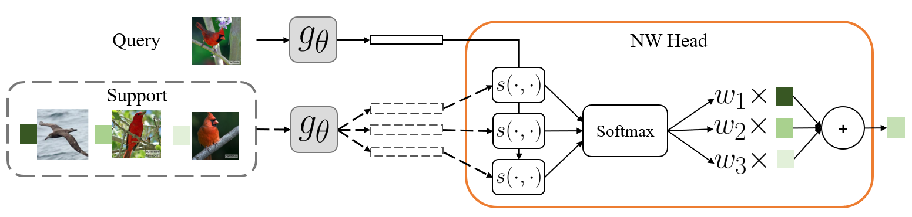
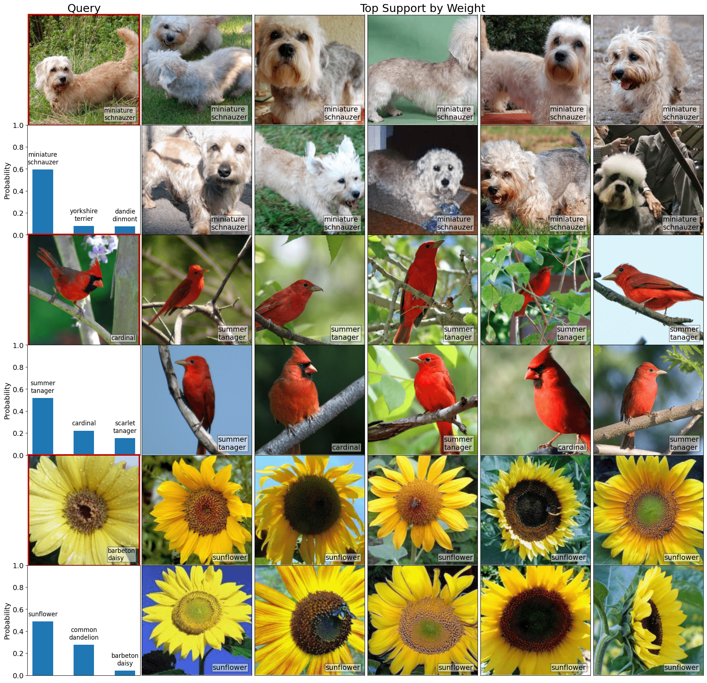
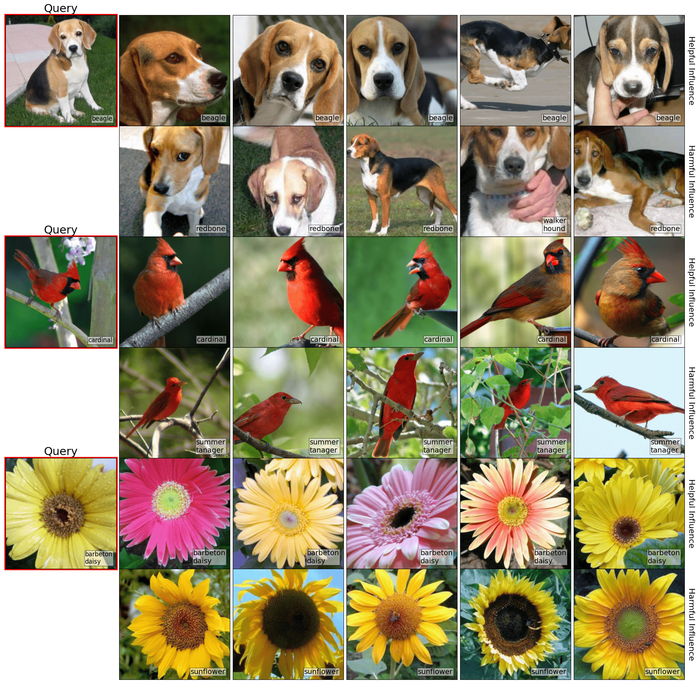

# Nadaraya-Watson (NW) Head
Repository containing training and evaluation code for the NW head - an interpretable/explainable, nonparametric classification head which can be used with any neural network.

[link to paper](https://openreview.net/forum?id=iEq6lhG4O3)

## NW Head
The NW head module is in `nwhead/nw.py`.
In its simplest form, the NW head code is:
```
import torch
import torch.nn as nn
import torch.nn.functional as F

class NWHead(nn.Module):
    def forward(self,
                query_feats,
                support_feats,
                support_labels):
        """
        Computes Nadaraya-Watson prediction.
        Returns (softmaxed) predicted probabilities.
        Args:
            query_feats: (b, embed_dim)
            support_feats: (b, num_support, embed_dim)
            support_labels: (b, num_support, num_classes)
        """
        query_feats = query_feats.unsqueeze(1)

        scores = -torch.cdist(query_feats, support_feats)
        probs = F.softmax(scores, dim=-1)
        return torch.bmm(probs, support_labels).squeeze(1)
```

## Usage
The submodule in `nwhead/` is designed to be portable, so that it can be inserted in an existing project flexibly.
An example of usage can be found in `train.py`.
For example, to train an NW head with ResNet-18 backbone:

```
import torch
from nwhead.nw import NWNet

# Data
train_dataset = ...
val_dataset = ...
train_loader = torch.utils.data.DataLoader(
    train_dataset, batch_size=batch_size, shuffle=True)

val_loader = torch.utils.data.DataLoader(
    val_dataset, batch_size=batch_size, shuffle=False)
num_classes = train_dataset.num_classes

# Feature extractor
feature_extractor = load_model('resnet18', num_classes)
feat_dim = 512

# NW Head
network = NWNet(feature_extractor, 
                train_dataset,
                num_classes,
                feat_dim,
                use_nll_loss=True)
network.train()

# Loss and optimizer
criterion = torch.nn.NLLLoss()
optimizer = torch.optim.SGD(network.parameters(), lr=1e-3)

# Training loop
for img, label in train_loader:
    img = img.float().to(device)
    label = label.to(device)
    optimizer.zero_grad()
    with torch.set_grad_enabled(True):
        output = network(img, label)
        loss = criterion(output, label)
        loss.backward()
        optimizer.step()

```
To perform evaluation, use the `predict()` method and pass in your desired inference mode.
Make sure to call `precompute()` beforehand.
```
network.eval()
network.precompute()
mode = 'full'

for img, label in val_loader:
    img, label = batch
    img = img.float().to(device)
    label = label.to(device)
    optimizer.zero_grad()
    with torch.set_grad_enabled(False):
        output = network.predict(img, mode)
        loss = criterion(output, label)
```

## Interpretability and Explainability
### Interpretablity via weights
Ranking support images by the `scores` variable enables sorting the support images by similarity, as in this figure:


### Explainability via support influence
The NW head naturally lends itself to a notion of “support influence" (Section 3.4 in the [paper](https://arxiv.org/pdf/2212.03411.pdf)) which finds the most helpful and most harmful examples in the support set for a given query image. The function to compute this is given in `util/metric.py`:
```
def support_influence(softmaxes, qlabels, sweights, slabels):
    '''
    Influence is defined as L(rescaled_softmax, qlabel) - L(softmax, qlabel).
    Positive influence => removing support image increases loss => support image was helpful
    Negative influence => removing support image decreases loss => support image was harmful
    bs should be 1.
    
    softmaxes: (bs, num_classes)
    qlabel: One-hot encoded query label (bs, num_classes)
    sweights: Weights between query and each support (bs, num_support)
    slabels: One-hot encoded support label (bs, num_support, num_classes)
    '''
    batch_influences = []
    bs = len(softmaxes)
    for bid in range(bs):
        softmax = softmaxes[bid]
        qlabel = qlabels[bid]
        sweight = sweights[bid]
        
        qlabel_cat = qlabel.argmax(-1).item()
        slabels_cat = slabels.argmax(-1)
        
        p = softmax[qlabel_cat]
        indicator = (slabels_cat==qlabel_cat).long()
        influences = torch.log((p - p*sweight)/(p - sweight*indicator))
    
        batch_influences.append(influences[None])
    return torch.cat(batch_influences, dim=0)
```

This figure shows results of ranking support images using support influence by most helpful and most harmful: 


## Training
Example command for training NW head:
```
python train.py \
  --models_dir out/ \ # Directory to save model outputs
  --data_dir ... \ # Directory where dataset lives
  --dataset bird  \ # Dataset to use
  --arch resnet18 \ # Feature extractor, $g_\theta$ in paper
  --train_method nwhead \ # Model to train, choose from [fchead, nwhead]
  --batch_size 32 \
  --lr 1e-3 \
  --num_epochs 1000 \
  --scheduler_milestones 500 750 \ # Epoch milestones to decrease lr via scheduler
```
This script will train for 1000 epochs and perform evaluation at the end of each epoch using random, full, and cluster inference modes.
Optionally, toggle the `--use_wandb` flag to log training results to Weights & Biases.

## Requirements
This code was run and tested on an Nvidia A6000 GPU with the following dependencies:
+ python 3.7.11
+ torch 1.10.1
+ torchvision 0.11.2
+ numpy 1.21.5

## Citation
If you use NW head or some part of the code, please cite:

Alan Q. Wang and Mert R. Sabuncu, "A Flexible Nadaraya-Watson Head Can Offer Explainable and Calibrated Classification" (TMLR 2023)
```
@article{
    wang2022nwhead,
    title={A Flexible Nadaraya-Watson Head Can Offer Explainable and Calibrated Classification},
    author={Alan Q. Wang and Mert R. Sabuncu},
    journal={Transactions on Machine Learning Research},
    issn={2835-8856},
    year={2022},
    url={https://openreview.net/forum?id=iEq6lhG4O3},
}
```
